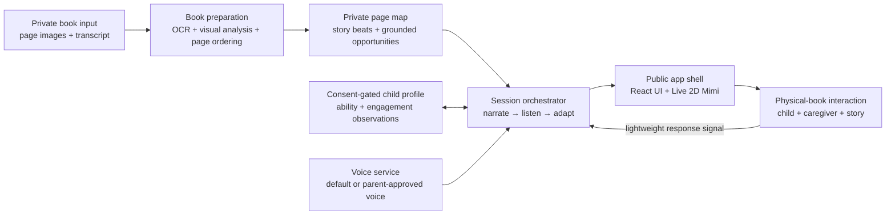

# Read-for-Xixi — public family build

Read-for-Xixi is a physical-book-first reading companion for families with young children. A responsive animated cat, Mimi, helps a parent sustain an engaging conversation around a real book without turning reading time into passive screen time.

This public repository is for parents and builders who want to understand, adapt, or create a similar experience for their own child. It shares the product thinking, public application shell, adaptive session model, and research base while keeping real books, family media, voices, and child information private.

## The product opportunity

Shared reading is valuable because it creates a loop between a child, a caregiver, and a story: notice, respond, expand, and respond again. In practice, that loop is difficult to sustain every day.

Parents may be tired after work, short on preparation time, unsure what to ask, or reading with a child who quickly loses interest. A conventional audiobook reduces effort but usually cannot notice the child's contribution or change what happens next. Individual tutoring can be responsive, but qualified help is expensive, difficult to schedule, and not available whenever a family opens a book.

Read-for-Xixi explores a middle path:

- keep the printed book and the parent–child relationship at the center;
- let software carry some of the preparation, narration, and improvisation burden;
- respond to what the child demonstrates instead of assuming ability from age;
- support multilingual families, beginning with Chinese interaction around both Chinese and English books;
- make the screen a small social presence—the animated cat—not a replacement digital book;
- help a tired parent participate without requiring constant laptop operation.

The initial audience is families reading with toddlers, especially children around 20–36 months, but adaptation is based on observed language, attention, and reasoning rather than an age label. The product is a shared-reading aid, not a medical, diagnostic, or speech-therapy tool.

### North-star outcome

The goal is not more screen time or the greatest number of pages completed. The primary outcome is more high-quality interaction loops: the child notices or contributes, the companion or parent responds meaningfully, and the exchange continues while both parent and child are enjoying the story.

Useful product signals include:

- spontaneous words, gestures, pointing, pretend actions, and questions from the child;
- conversational turns completed without testing or pressuring the child;
- the child's willingness to stay with or return to the physical book;
- the parent's enjoyment and sense that the support reduced effort;
- successful transitions from the story into parent–child conversation or play.

## End-to-end family experience

### 1. Prepare a physical book

The parent privately provides clear page images, a transcript, or both. Images preserve visual context—characters, objects, expressions, action, counting opportunities, and page order—while a transcript improves textual accuracy. When possible, the two inputs complement each other.

The preparation pipeline turns the book into a page map containing:

- the page's story beat and emotional purpose;
- important visible details grounded in the actual illustration;
- a short narration or bridge;
- one simple invitation to notice, predict, explain, count, compare, or pretend;
- up to two or three possible expansions if the child remains engaged;
- safe exit points that let the story continue naturally.

Book pages and production interaction scripts are private and are not included here.

### 2. Choose the reading voice

A caregiver can use a natural default voice or, with explicit consent, configure a parent-voice pathway. The setup can also capture the child's name separately so it can be used naturally without embedding family information in public content.

Voice cloning requires clear consent, secure storage, a deletion path, and protection against use outside the family's reading sessions. The public build contains no recordings or generated voice assets.

### 3. Start reading together

The parent places the real book in front of the child. Mimi appears as a responsive animated cat and opens with a brief, playful story-time introduction. The illustration stays in the physical book; the screen does not duplicate the page.

Mimi delivers a short page-aligned line, then makes space for the child. Prompts are invitations inside the story, not quizzes. The product avoids unnecessary instructions such as announcing that it is time to turn a page, explaining interface mechanics aloud, or reassuring the child after every pause.

### 4. Respond to the child

The child may answer with a sentence, one word, a sound, a gesture, a facial expression, pointing, or pretend play. All are treated as meaningful participation.

When the child contributes, the next line should connect to the likely meaning of that contribution. For example, it may:

- expand a short response into a slightly richer sentence;
- ask a simple cause-and-effect or prediction question;
- connect two events into a tiny narrative;
- notice color, quantity, size, emotion, or spatial relationships;
- add a brief, child-relevant fact;
- invite a physical or pretend action connected to the page.

If engagement is strong, the exchange can continue for up to two or three expansions. If attention drops, the system shortens the next turn and returns to the story. Silence is not treated as failure, and the parent is not asked to repeatedly test, correct, or make the child perform.

### 5. Adapt over time

The system maintains separate observations instead of assigning one vague level to the child:

- **language:** gesture, single word, phrase, sentence, or connected explanation;
- **cognition:** naming, matching, counting, prediction, cause and effect, or story sequencing;
- **engagement:** attention, excitement, imitation, avoidance, or desire to continue;
- **support needed:** independent response, parent modeling, repetition, or a simpler invitation.

The next interaction changes one step at a time. A child who answers easily receives richer language or reasoning. A child who is interested but not speaking can receive a gesture or pretend-play invitation. A tired or disengaged child gets a shorter line and fewer interruptions. The system should preserve continuity and avoid turning shared reading into an assessment session.

### 6. Finish without pulling the child out of the story

A session ends with a natural story closing or a small related activity—not a dashboard spoken to the child. Any caregiver summary is optional, brief, and shown afterward. The product can remember lightweight parent-approved observations for the next session without storing raw child audio by default.

## Technical architecture

The intended production system separates private family content from the reusable application and session engine.



### System responsibilities

| Layer | Responsibility | Privacy boundary |
| --- | --- | --- |
| Book preparation | OCR, visual grounding, spread order, story structure, and developmental opportunities | Processes private book inputs; outputs are not committed publicly |
| Page map | Stores page-aligned narration, prompts, expansions, and pacing rules | Private content service |
| Session engine | Controls narration, listening space, response handling, adaptation, and reset behavior | Reusable logic; contains no real book text |
| Response interpretation | Converts a parent signal or future speech/gesture signal into a small set of interaction observations | Prefer ephemeral processing and derived observations over raw recordings |
| Adaptation policy | Chooses whether to expand, simplify, change modality, or continue the story | Uses ability dimensions separately; avoids diagnosis |
| Voice pathway | Renders a natural default voice or a consent-based parent voice | Voice assets stay in private storage with deletion controls |
| Companion client | Presents Mimi's voice, facial reactions, timing, and minimal controls | Public React/SVG shell contains no family content |

### Session state machine

The public prototype includes a deterministic state machine with four stages:

```text
READY → NARRATING → LISTENING → ADAPTING
                    ↑              |
                    └──────────────┘
```

- `READY`: the family has the physical book and starts the prepared session.
- `NARRATING`: Mimi delivers a short page-aligned turn.
- `LISTENING`: the system deliberately leaves room for the child and caregiver.
- `ADAPTING`: the next turn changes based on the observed response and engagement.

This explicit model makes pacing testable and prevents the companion from continuously talking over the family. The public implementation accepts a simple response event; a production version can connect that event to parent controls or carefully consented multimodal interpretation.

### Public repository structure

```text
Read-for-Xixi/
├── src/
│   ├── App.tsx            # Responsive product shell and animated Mimi
│   ├── productEngine.ts   # Typed session states, events, and privacy boundary
│   ├── main.tsx           # React entry point
│   └── styles.css         # Responsive visual system and animation
├── research/              # Curated evidence, product implications, and sources
├── index.html
├── package.json
└── vite.config.ts
```

## What the public prototype demonstrates

- a physical-book-first, low-screen product model;
- a responsive animated Live 2D companion built with React and SVG;
- a deterministic, inspectable reading-session state machine;
- clear separation between reusable code and private content;
- responsive and accessible interface foundations;
- a path from page preparation to adaptive dialogue and voice rendering.

It does not contain production speech recognition, voice cloning, private page maps, real child profiles, or a clinical language model. Those capabilities require additional consent, safety, evaluation, and infrastructure work.

## Privacy and safety principles

- Do not commit real book pages, transcripts, recordings, generated voices, or child profiles to the public repository.
- Do not store raw child audio by default when a short-lived signal or parent input is sufficient.
- Require explicit caregiver consent and a clear deletion path for any voice customization.
- Keep generated prompts grounded in the supplied page; do not invent visual details.
- Treat gestures, expressions, pointing, and pretend play as participation—not only spoken answers.
- Do not present adaptive observations as diagnosis or guaranteed developmental gains.
- Design Mimi to support the caregiver–child relationship rather than replace it.

## Run locally

```bash
npm install
npm run dev
```

## Research

The [`research/`](research/) folder contains the evidence base that informed the product direction: shared reading and language development, caregiver barriers, adaptive interaction design, familiar voices, avatar feasibility, product landscape, and source references.

Raw transcripts, book-specific page maps, user-session records, and family-specific content are excluded from this public version.
