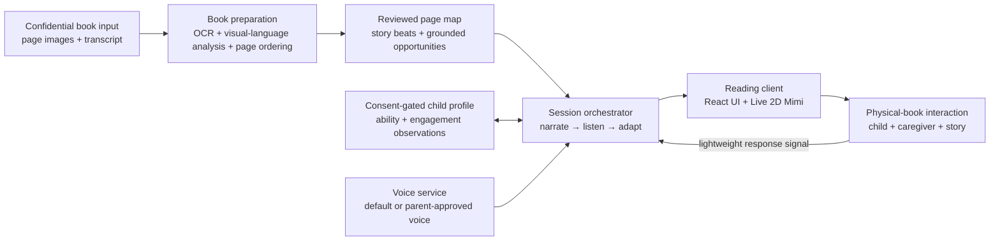

# Read-for-Xixi

Read-for-Xixi is a physical-book-first reading companion for families with young children. A responsive animated cat, Mimi, helps a parent sustain an engaging conversation around a real book without turning reading time into passive screen time.

This repository describes and implements the complete Read-for-Xixi product architecture: the physical-book experience, Live 2D companion, page-preparation pipeline, adaptive dialogue system, CosyVoice narration pathway, interaction profile, and privacy boundaries. Copyrighted books and family data are represented by protected placeholder folders and synthetic manifests.

## The product opportunity

Shared reading is valuable because it creates a loop between a child, a caregiver, and a story: notice, respond, expand, and respond again. In practice, that loop is difficult to sustain every day.

### Why shared reading matters for language and thinking

The evidence supports shared reading as a useful, developmentally rich routine—especially when it is interactive. The [American Academy of Pediatrics' 2024 policy](https://publications.aap.org/pediatrics/article/154/6/e2024069090/199467/Literacy-Promotion-An-Essential-Component-of) recommends reading aloud and shared reading from infancy because the activity supports language, cognitive, social-emotional, and early-literacy development while strengthening the caregiver–child relationship.

Research findings most relevant to this product include:

- **Expressive and receptive language:** a [2020 meta-analysis of 19 randomized trials](https://eric.ed.gov/?id=EJ1246036), covering 2,594 children ages 1–6, found small-to-moderate improvements in expressive language (`d=0.41`) and receptive language (`d=0.26`). The largest effect was on caregiver book-sharing skill (`d=1.01`), suggesting that improving the adult–child interaction is an important mechanism.
- **Vocabulary learning:** a [meta-analysis of 38 shared-storybook studies](https://pubmed.ncbi.nlm.nih.gov/29595311/) involving 2,455 children found that children learned words through shared reading and that the way adults interacted around the book helped explain differences in outcomes. Repetition, pointing, explanations, and dialogic exchanges make new words easier to connect to meaning.
- **Conversational turn-taking:** a [randomized parent-coaching study](https://pubmed.ncbi.nlm.nih.gov/32015127/) found that increasing parentese and back-and-forth turns was associated with gains in infant vocalizations and language. A [30-month follow-up](https://pubmed.ncbi.nlm.nih.gov/36999222/) reported lasting language differences that were partly mediated by conversational turns. The follow-up sample was small, so the result is promising rather than definitive.
- **Attention and memory:** following a story asks a child to maintain joint attention, hold earlier events in mind, recognize repeated patterns, and connect what is happening now with what happened before. Re-reading the same book can strengthen familiarity with vocabulary, event order, and narrative structure.
- **Reasoning and narrative cognition:** well-timed questions such as “What might happen next?”, “Why is she sad?”, or “How can they fix it?” give children practice with prediction, cause and effect, sequencing, inference, and perspective-taking. These skills are exercised through the conversation around the story, not merely by hearing more words.
- **Mental imagery and meaning-making:** an exploratory [fMRI study of preschool children](https://pubmed.ncbi.nlm.nih.gov/25825501/) found that greater home reading exposure was associated with stronger activation in brain regions involved in semantic processing and mental imagery while listening to stories. This was correlational and does not prove that reading alone caused the neural differences, but it supports the idea that children actively construct meaning and imagined scenes from narrative language.

This evidence directly shapes Read-for-Xixi. Mimi should create joint attention, leave room for turns, repeat and expand useful language, and occasionally invite prediction, explanation, counting, comparison, emotion talk, or story sequencing. She should not continuously narrate, quiz the child on every page, or treat silence as failure.

Parents may be tired after work, short on preparation time, unsure what to ask, or reading with a child who quickly loses interest. A conventional audiobook reduces effort but usually cannot notice the child's contribution or change what happens next. Individual tutoring can be responsive, but qualified help is expensive, difficult to schedule, and not available whenever a family opens a book.

Read-for-Xixi explores a middle path:

- keep the printed book and the parent–child relationship at the center;
- let software carry some of the preparation, narration, and improvisation burden;
- respond to what the child demonstrates instead of assuming ability from age;
- support multilingual families, beginning with Chinese interaction around both Chinese and English books;
- make the screen a small social presence—the animated cat—not a replacement digital book;
- help a tired parent participate without requiring constant laptop operation.

The initial audience is families reading with toddlers, especially children around 20–36 months, but adaptation is based on observed language, attention, and reasoning rather than an age label. The product is a shared-reading aid, not a medical, diagnostic, or speech-therapy tool.

### North-star outcome

The goal is not more screen time or the greatest number of pages completed. The primary outcome is more high-quality interaction loops: the child notices or contributes, the companion or parent responds meaningfully, and the exchange continues while both parent and child are enjoying the story.

Useful product signals include:

- spontaneous words, gestures, pointing, pretend actions, and questions from the child;
- conversational turns completed without testing or pressuring the child;
- the child's willingness to stay with or return to the physical book;
- the parent's enjoyment and sense that the support reduced effort;
- successful transitions from the story into parent–child conversation or play.

## End-to-end family experience

### 1. Prepare a physical book

The parent provides clear page images, a transcript, or both through a confidential ingestion flow. Images preserve visual context—characters, objects, expressions, action, counting opportunities, and page order—while a transcript improves textual accuracy. When possible, the two inputs complement each other.

The preparation pipeline turns the book into a page map containing:

- the page's story beat and emotional purpose;
- important visible details grounded in the actual illustration;
- a short narration or bridge;
- one simple invitation to notice, predict, explain, count, compare, or pretend;
- up to two possible expansions if the child remains engaged;
- safe exit points that let the story continue naturally.

Book pages and page-specific production scripts plug into the typed architecture through the protected [`confidential/books/`](confidential/books/) directory. The repository contains schemas and synthetic placeholders, not copyrighted book content.

### 2. Choose the reading voice

A caregiver can use a natural default voice or, with explicit consent, configure a parent-voice pathway. The setup can also capture the child's name separately so it can be used naturally without embedding family information in application source.

Voice cloning requires clear consent, secure storage, a deletion path, and protection against use outside the family's reading sessions. Reference recordings and generated voice assets belong in the protected confidential-content layer.

### 3. Start reading together

The parent places the real book in front of the child. Mimi appears as a responsive animated cat and opens with a brief, playful story-time introduction. The illustration stays in the physical book; the screen does not duplicate the page.

Mimi delivers a short page-aligned line, then makes space for the child. Prompts are invitations inside the story, not quizzes. The product avoids unnecessary instructions such as announcing that it is time to turn a page, explaining interface mechanics aloud, or reassuring the child after every pause.

### 4. Respond to the child

The child may answer with a sentence, one word, a sound, a gesture, a facial expression, pointing, or pretend play. All are treated as meaningful participation.

When the child contributes, the next line should connect to the likely meaning of that contribution. For example, it may:

- expand a short response into a slightly richer sentence;
- ask a simple cause-and-effect or prediction question;
- connect two events into a tiny narrative;
- notice color, quantity, size, emotion, or spatial relationships;
- add a brief, child-relevant fact;
- invite a physical or pretend action connected to the page.

If engagement is strong, the exchange can continue for up to two expansions. If attention drops, the system shortens the next turn and returns to the story. Silence is not treated as failure, and the parent is not asked to repeatedly test, correct, or make the child perform.

### 5. Adapt over time

The system maintains separate observations instead of assigning one vague level to the child:

- **language:** gesture, single word, phrase, sentence, or connected explanation;
- **cognition:** naming, matching, counting, prediction, cause and effect, or story sequencing;
- **engagement:** attention, excitement, imitation, avoidance, or desire to continue;
- **support needed:** independent response, parent modeling, repetition, or a simpler invitation.

The next interaction changes one step at a time. A child who answers easily receives richer language or reasoning. A child who is interested but not speaking can receive a gesture or pretend-play invitation. A tired or disengaged child gets a shorter line and fewer interruptions. The system should preserve continuity and avoid turning shared reading into an assessment session.

### 6. Finish without pulling the child out of the story

A session ends with a natural story closing or a small related activity—not a dashboard spoken to the child. Any caregiver summary is optional, brief, and shown afterward. The product can remember lightweight parent-approved observations for the next session without storing raw child audio by default.

## Technical architecture

The system separates confidential family and book content from reusable product logic.



### Where AI is used

Read-for-Xixi uses AI for the parts of shared reading that benefit from perception, language generation, response interpretation, and natural voice. It does **not** give an unconstrained AI agent control of the session. A deterministic session engine controls when Mimi may speak, listen, adapt, or stop; AI services operate inside those boundaries.

The current prototype implements the physical-book reading client, page-synchronized interaction branches, parent-confirmed response loop, Live 2D Mimi, and locked natural Mandarin audio rendered with CosyVoice 3. This repository also includes typed boundaries for multimodal book preparation, grounded dialogue generation, response interpretation, adaptive policy, session orchestration, and the consented parent-voice pathway. Automatic toddler-speech interpretation is still a future capability and is not represented as complete.

| AI capability | Input | Output | Current status |
| --- | --- | --- | --- |
| Multimodal book understanding | Confidential page images and optional transcript | Page order, visible entities, expressions, actions, story beats, and interaction opportunities | Page analysis workflow explored; typed adapter and review boundary included |
| Grounded dialogue generation | Current page map, previous turns, interaction rules, and ability observations | Short Chinese narration, one invitation, and up to two relevant expansions | Page-specific scripts prepared with human review; typed grounded-generation boundary included |
| Response interpretation | Future child speech signal, parent input, and conversational context | A small semantic observation such as naming, predicting, counting, gesturing, or no clear response | Parent-confirmed signal in the current prototype; automatic interpretation is future work |
| Adaptive turn selection | Language, cognition, engagement, support needed, page state, and expansion count | Expand, simplify, change modality, continue the story, or stop prompting | Deterministic policy shell implemented; richer scoring is a production direction |
| Mandarin speech generation | Approved Chinese script plus a selected default or consented reference voice | Natural page-aligned narration with timing metadata | Locked CosyVoice 3 Mandarin voice implemented; adapter included; confidential audio excluded |
| Companion expression control | Session state and future speech timing or viseme cues | Mimi's listening, speaking, smiling, and reaction states | State-driven React/SVG Live 2D behavior implemented; richer lip sync is future work |

#### 1. Multimodal page understanding

A vision-language preparation step examines each supplied spread together with OCR or a parent-provided transcript. The objective is not to rewrite the book. It creates structured, page-grounded metadata: who is present, what is visibly happening, how a character may feel, which objects can be counted or compared, and how this page moves the story forward.

Visual and textual evidence are kept together because each has different failure modes. OCR may miss stylized type, a transcript may omit illustration-only details, and a vision model may misidentify an object. The preparation workflow should preserve uncertainty and allow caregiver review rather than treating every model observation as fact.

#### 2. Page-grounded dialogue generation

The language model receives only the current page map, limited prior context, the child's approved ability observations, and explicit dialogue rules. This is a constrained grounding pattern similar to retrieval-augmented generation: the model works from the family's prepared page record instead of inventing a generic story from memory.

Generation constraints include:

- speak in natural, age-appropriate Chinese even when the physical book is in English;
- keep English personal names in their original form;
- ask one clear question at a time;
- make the first follow-up connect meaningfully to the likely child response;
- permit no more than two expansions before returning to the story;
- avoid repeated reassurance, testing language, correction, performance requests, or interface narration;
- never claim to see an illustration detail that is absent from the page map.

Page scripts should be generated during book preparation and reviewed before use. The live session can select or lightly personalize approved alternatives without allowing open-ended story generation around a young child.

#### 3. Child-response understanding

Toddler speech is harder to recognize than adult speech: pronunciation is still developing, sentences may mix languages, and gestures often carry part of the meaning. For that reason, the MVP does not need to depend on always-on automatic speech recognition.

The current interaction can use a low-effort caregiver signal that the child responded. The session then chooses a prepared expansion that makes sense for likely answers. A future system could combine short-lived speech recognition, language identification, confidence scoring, and optional gesture or attention signals, but it should fall back gracefully when confidence is low. A low-confidence result must not be interpreted as low ability.

#### 4. Hybrid adaptation: rules around models

Adaptation is deliberately hybrid:

- a typed state machine controls pacing and guarantees listening space;
- hard rules cap the number and length of expansions;
- a small policy combines language, cognition, engagement, and support observations;
- a language model realizes the selected strategy as a natural line grounded in the page;
- parent controls can override the system at any time.

This separation makes behavior easier to test than a single autonomous prompt. It also lets the product improve one layer—speech recognition, response classification, dialogue quality, or voice—without changing the entire child-facing experience.

#### 5. Natural Mandarin voice and parent-voice pathway

The prototype uses CosyVoice 3 for natural Mandarin narration and defines a consent-based parent-voice pathway. The intended setup uses a short, clearly disclosed recording task so the caregiver knows exactly what is captured. Voice assets must be encrypted, limited to the family's reading experience, and deletable by the caregiver.

The voice model produces audio, but the session engine remains responsible for pacing. Speech timing can also drive mouth movement and facial reactions; the animation itself is not generative AI. Model weights, reference recordings, consent records, and generated audio stay in the confidential runtime layer.

#### 6. Evaluation and AI safety

AI quality has to be evaluated at the interaction level, not only by whether a sentence sounds fluent. Important test sets and session reviews include:

- **grounding:** did Mimi mention only people, objects, and events supported by the supplied page?
- **response relevance:** did the follow-up make sense for what the child probably communicated?
- **developmental fit:** was the line short enough, clear enough, and only slightly more complex than the child's demonstrated response?
- **conversation balance:** did Mimi pause and leave room, or dominate the interaction?
- **parent burden:** how many times did the caregiver need to operate the device?
- **uncertainty behavior:** did the system simplify or defer when speech or page understanding was unclear?
- **privacy:** were raw inputs retained only when necessary and with explicit consent?

The most important model comparison is not “Which output sounds smartest?” It is “Which system produces a safer, more natural, more enjoyable parent–child interaction around the real book?”

### System responsibilities

| Layer | Responsibility | Privacy boundary |
| --- | --- | --- |
| Book preparation | OCR, visual grounding, spread order, story structure, and developmental opportunities | Processes confidential book inputs; adapters and types live in `src/ai/` |
| Page map | Stores page-aligned narration, prompts, expansions, and pacing rules | Confidential content layer represented by placeholders |
| Session engine | Controls narration, listening space, response handling, adaptation, and reset behavior | Reusable logic; contains no real book text |
| Response interpretation | Converts a parent signal or future speech/gesture signal into a small set of interaction observations | Prefer ephemeral processing and derived observations over raw recordings |
| Adaptation policy | Chooses whether to expand, simplify, change modality, or continue the story | Uses ability dimensions separately; avoids diagnosis |
| Voice pathway | Renders a natural default voice or a consent-based parent voice | Voice assets stay in confidential storage with deletion controls |
| Companion client | Presents Mimi's voice, facial reactions, timing, and minimal controls | React/SVG client receives opaque content and audio references |

### Session state machine

The prototype includes a deterministic state machine with four stages:

```text
READY → NARRATING → LISTENING → ADAPTING
                    ↑              |
                    └──────────────┘
```

- `READY`: the family has the physical book and starts the prepared session.
- `NARRATING`: Mimi delivers a short page-aligned turn.
- `LISTENING`: the system deliberately leaves room for the child and caregiver.
- `ADAPTING`: the next turn changes based on the observed response and engagement.

This explicit model makes pacing testable and prevents the companion from continuously talking over the family. The MVP accepts a parent-confirmed response event; a future version can connect the same event boundary to carefully consented multimodal interpretation.

### Repository architecture

```text
Read-for-Xixi/
├── src/
│   ├── ai/                # Multimodal preparation, grounded dialogue, response interpretation
│   ├── adaptation/        # Deterministic policy around generated language
│   ├── domain/            # Book, child-response, dialogue, and profile types
│   ├── session/           # Orchestration across observation, policy, and generation
│   ├── voice/             # CosyVoice 3 and consented parent-voice adapter boundary
│   ├── App.tsx            # Responsive reading client and animated Mimi
│   ├── productEngine.ts   # Reading-session state machine
│   ├── main.tsx           # React entry point
│   └── styles.css         # Responsive visual system and animation
├── confidential/          # Protected placeholders and synthetic manifests
├── research/              # Curated evidence, product implications, and sources
├── index.html
├── package.json
└── vite.config.ts
```

## Current product status

- two prepared physical-book experiences with page-synchronized Mandarin narration and two response expansions per spread;
- exactly three parent controls during reading: replay, child responded, and next physical page;
- a responsive animated Live 2D Mimi with speaking, listening, mood, and reaction states;
- a locked expressive Mandarin Mimi voice rendered with CosyVoice 3;
- a 60-second caregiver voice-sample flow and separate child-name recording flow for the future parent-voice pathway;
- a deterministic, inspectable reading-session state machine and adaptive policy;
- typed multimodal preparation, grounded dialogue, response interpretation, CosyVoice, and orchestration boundaries;
- clear separation between reusable code and confidential book or family content;
- responsive desktop and mobile interface foundations.

The repository does not contain real book pages, production scripts, generated audio, voice references, family recordings, or real child profiles. Those assets connect through the documented confidential-content layer. Automatic toddler-speech interpretation and persistent production voice cloning remain future work; the product does not claim to provide clinical assessment.

## Privacy and safety principles

- Do not commit real book pages, transcripts, recordings, generated voices, or child profiles to source control.
- Do not store raw child audio by default when a short-lived signal or parent input is sufficient.
- Require explicit caregiver consent and a clear deletion path for any voice customization.
- Keep generated prompts grounded in the supplied page; do not invent visual details.
- Treat gestures, expressions, pointing, and pretend play as participation—not only spoken answers.
- Do not present adaptive observations as diagnosis or guaranteed developmental gains.
- Design Mimi to support the caregiver–child relationship rather than replace it.

## Run locally

```bash
npm install
npm run dev
```

## Research

The [`research/`](research/) folder contains the evidence base that informed the product direction: shared reading and language development, caregiver barriers, adaptive interaction design, familiar voices, avatar feasibility, product landscape, and source references.

Raw transcripts, book-specific page maps, user-session records, and family-specific content are represented by protected folders and synthetic placeholders.
